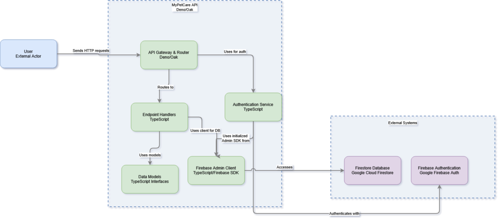

# MyPetCare API 🐾

**Backend API para la aplicación MyPetCare desarrollada con Deno 2.0**

Una API REST robusta y moderna para la gestión integral de clínicas veterinarias, que facilita la administración de mascotas, citas, tratamientos, reportes y más.

## 📋 Tabla de Contenido

- [Características](#-características)
- [Tecnologías](#-tecnologías)
- [Instalación](#-instalación)
- [Configuración](#-configuración)
- [Uso](#-uso)
- [Estructura del Proyecto](#-estructura-del-proyecto)
- [Scripts Disponibles](#-scripts-disponibles)
- [Endpoints](#-endpoints)
- [Documentación de la API](#-documentación-de-la-api)
- [Testing](#-testing)
- [Contribuir](#-contribuir)
- [Licencia](#-licencia)

## ✨ Características

- 🔐 **Autenticación y autorización** con Firebase Auth
- 🏥 **Gestión de clínicas veterinarias** y veterinarios
- 🐕 **Administración de mascotas** y propietarios
- 📅 **Sistema de citas** con bloqueo de horarios
- 💊 **Prescripciones médicas** y tratamientos
- 📊 **Reportes médicos** y seguimiento
- 💉 **Control de vacunas**
- 🏠 **Sistema de adopciones**
- 📰 **Gestión de noticias**
- 🌐 **CORS configurado** para múltiples orígenes
- 📝 **Documentación completa** con Swagger/OpenAPI

## 💼 Arquitectura

La API MyPetCare sigue una arquitectura modular y escalable basada en Deno/Oak con integración a Firebase:



*Diagrama de arquitectura de la API MyPetCare mostrando la interacción entre componentes*

### Componentes principales:

- **API Gateway & Router**: Punto de entrada principal que maneja el enrutamiento de peticiones HTTP
- **Endpoint Handlers**: Controladores específicos para cada endpoint que procesan la lógica de negocio
- **Authentication Service**: Servicio de autenticación que valida tokens y permisos de usuario
- **Firebase Admin Client**: Cliente que gestiona la comunicación con los servicios de Firebase
- **Data Models**: Interfaces TypeScript que definen la estructura de los datos
- **External Systems**: Servicios externos de Google Cloud (Firestore y Firebase Auth)


## 🛠 Tecnologías

- **[Deno 2.0](https://deno.land/)** - Runtime de JavaScript/TypeScript
- **[Oak](https://deno.land/x/oak)** - Framework web para Deno
- **[TypeScript](https://www.typescriptlang.org/)** - Tipado estático
- **[Swagger/OpenAPI](https://swagger.io/)** - Documentación de API

## 📦 Instalación

### Prerrequisitos

- [Deno 2.0](https://deno.land/manual/getting_started/installation) instalado
- Cuenta de [Firebase](https://firebase.google.com/) configurada
- Archivo `serviceAccountKey.json` de Firebase

### Pasos de instalación

1. **Clona el repositorio:**
   ```bash
   git clone https://github.com/GabrielJuan349/MyPetCare.git
   cd MyPetCare/MyPetCare-api
   ```

2. **Configura las variables de entorno:**
   ```bash
   # Crea un archivo .env en la raíz del proyecto
   cp .env.example .env
   ```

3. **Configura Firebase:**
   - Coloca tu archivo `serviceAccountKey.json` en la raíz del proyecto
   - Actualiza la configuración en `firebaseconfig/firebase.ts`

## ⚙️ Configuración

### Variables de Entorno

Crea un archivo `.env` con las siguientes variables:

```env
# Puerto del servidor
API_PORT=4000

# URL base de la API
API_URL=http://localhost:

# Configuración de Firebase
FIREBASE_PROJECT_ID=tu-proyecto-id
FIREBASE_CLIENT_EMAIL=tu-client-email
FIREBASE_PRIVATE_KEY=tu-private-key

# Configuración de CORS
ALLOWED_ORIGINS=http://localhost:4200,http://localhost:3000
```

### Configuración de Firebase

1. Ve a la [Consola de Firebase](https://console.firebase.google.com/)
2. Crea un nuevo proyecto o selecciona uno existente
3. Ve a "Configuración del proyecto" > "Cuentas de servicio"
4. Genera una nueva clave privada y descarga el archivo JSON
5. Renombra el archivo a `serviceAccountKey.json` y colócalo en la raíz del proyecto

## 🚀 Uso

### Desarrollo

```bash
# Ejecutar en modo desarrollo con hot reload
deno task dev
```

### Producción

```bash
# Ejecutar en modo producción
deno task start
```

### Otros comandos útiles

```bash
# Formatear código
deno task fmt

# Ejecutar linter
deno task lint

# Ejecutar tests
deno task test
```

## 📁 Estructura del Proyecto

```
MyPetCare-api/
├── api-functions/           # Funciones de la API
│   ├── adoption.ts         # Gestión de adopciones
│   ├── appointments.ts     # Gestión de citas
│   ├── authenticate.ts     # Autenticación
│   ├── blocked-request.ts  # Horarios bloqueados
│   ├── clinics.ts         # Gestión de clínicas
│   ├── firebase.ts        # Configuración Firebase
│   ├── gestion.usuarios.ts # Gestión de usuarios
│   ├── news.ts            # Gestión de noticias
│   ├── pet-request.ts     # Gestión de mascotas
│   ├── prescription.ts    # Prescripciones médicas
│   ├── registerUser.ts    # Registro de usuarios
│   ├── report.ts          # Reportes médicos
│   ├── treatment.ts       # Tratamientos
│   ├── utils.ts           # Utilidades
│   ├── vaccines.ts        # Control de vacunas
│   ├── validateToken.ts   # Validación de tokens
│   └── vets.ts            # Gestión de veterinarios
├── certs/                  # Certificados SSL
├── firebaseconfig/         # Configuración Firebase
│   └── firebase.ts
├── interfaces/             # Interfaces TypeScript
│   ├── adoption.interface.ts
│   ├── appointments.interface.ts
│   ├── clinic.interface.ts
│   ├── news.interface.ts
│   ├── pet.interface.ts
│   ├── prescription.interface.ts
│   ├── report.interface.ts
│   ├── treatment.interface.ts
│   ├── user.interface.ts
│   └── vets.interface.ts
├── deno.json              # Configuración de Deno
├── deno.lock              # Lock file de dependencias
├── main.ts                # Archivo principal
├── main_test.ts           # Tests principales
├── swagger.yaml           # Documentación OpenAPI
└── serviceAccountKey.json # Clave de servicio Firebase
```

## 📖 Scripts Disponibles

| Comando | Descripción |
|---------|-------------|
| `deno task dev` | Ejecuta la API en modo desarrollo con hot reload |
| `deno task start` | Ejecuta la API en modo producción |
| `deno task test` | Ejecuta todos los tests |
| `deno task lint` | Ejecuta el linter para revisar el código |
| `deno task fmt` | Formatea el código según las reglas configuradas |

## 🔌 Endpoints

### Autenticación
- `POST /api/authenticate` - Autenticar usuario
- `POST /api/validateToken` - Validar token de autenticación
- `POST /api/registerUser` - Registrar nuevo usuario

### Usuarios
- `PUT /api/updateUser/:id` - Actualizar datos de usuario
- `DELETE /api/deleteUser/:id` - Eliminar usuario
- `GET /api/getUserData/:id` - Obtener datos de usuario

### Mascotas
- `POST /api/createPet` - Crear nueva mascota
- `GET /api/pet/:id` - Obtener mascota por ID
- `GET /api/pets/owner/:ownerId` - Obtener mascotas por propietario
- `PUT /api/updatePet/:id` - Actualizar mascota
- `DELETE /api/deletePet/:id` - Eliminar mascota

### Citas
- `POST /api/newAppointment` - Crear nueva cita
- `GET /api/appointment/:id` - Obtener cita por ID
- `GET /api/appointments/vet/:vetId` - Obtener citas por veterinario
- `GET /api/appointments/owner/:ownerId` - Obtener citas por propietario
- `DELETE /api/deleteAppointment/:id` - Eliminar cita

### Clínicas
- `POST /api/createClinic` - Crear nueva clínica
- `GET /api/clinics` - Obtener todas las clínicas
- `GET /api/clinic/:id` - Obtener clínica por ID
- `DELETE /api/deleteClinic/:id` - Eliminar clínica

### Veterinarios
- `POST /api/createVet` - Crear nuevo veterinario
- `GET /api/vet/:id` - Obtener veterinario por ID
- `GET /api/vets/clinic/:clinicId` - Obtener veterinarios por clínica
- `DELETE /api/deleteVet/:id` - Eliminar veterinario

### Prescripciones
- `POST /api/createPrescription` - Crear nueva prescripción
- `GET /api/prescription/:id` - Obtener prescripción por ID
- `GET /api/prescriptions/pet/:petId` - Obtener prescripciones por mascota
- `PUT /api/updatePrescription/:id` - Actualizar prescripción
- `DELETE /api/deletePrescription/:id` - Eliminar prescripción

### Reportes
- `POST /api/createReport` - Crear nuevo reporte
- `GET /api/report/:id` - Obtener reporte por ID
- `GET /api/reports/vet/:vetId` - Obtener reportes por veterinario
- `GET /api/reports/pet/:petId` - Obtener reportes por mascota
- `DELETE /api/deleteReport/:id` - Eliminar reporte

### Tratamientos
- `POST /api/createTreatment` - Crear nuevo tratamiento
- `GET /api/treatment/:id` - Obtener tratamiento por ID
- `GET /api/treatments/vet/:vetId` - Obtener tratamientos por veterinario
- `GET /api/treatments/pet/:petId` - Obtener tratamientos por mascota
- `DELETE /api/deleteTreatment/:id` - Eliminar tratamiento

### Vacunas
- `POST /api/createVaccine` - Crear nuevo registro de vacuna
- `GET /api/vaccines/pet/:petId` - Obtener vacunas por mascota

### Adopciones
- `POST /api/createAdoption` - Crear nueva adopción
- `GET /api/adoptions` - Obtener todas las adopciones
- `GET /api/adoption/:id` - Obtener adopción por ID
- `GET /api/adoptions/clinic/:clinicId` - Obtener adopciones por clínica
- `PUT /api/updateAdoption/:id` - Actualizar adopción
- `DELETE /api/deleteAdoption/:id` - Eliminar adopción

### Noticias
- `POST /api/createNews` - Crear nueva noticia
- `GET /api/news` - Obtener todas las noticias
- `DELETE /api/deleteNews/:id` - Eliminar noticia

### Otros
- `POST /api/monthBlockedRequest` - Gestionar horarios bloqueados
- `GET /` - Estado de la API


## 📚 Documentación de la API

La documentación completa de la API está disponible en formato Swagger/OpenAPI en el archivo `swagger.yaml`. 

Para visualizar la documentación:

1. Instala una herramienta como Swagger UI
2. Abre el archivo `swagger.yaml` en tu herramienta preferida
3. O utiliza editores online como [Swagger Editor](https://editor.swagger.io/)

## 🧪 Testing

```bash
# Ejecutar todos los tests
deno task test

# Ejecutar tests con cobertura
deno test --coverage=coverage --allow-net --allow-read --allow-env --allow-import

# Ver reporte de cobertura
deno coverage coverage
```

## 🤝 Contribuir

1. Fork el proyecto
2. Crea una rama para tu feature (`git checkout -b feature/AmazingFeature`)
3. Commit tus cambios (`git commit -m 'Add some AmazingFeature'`)
4. Push a la rama (`git push origin feature/AmazingFeature`)
5. Abre un Pull Request

### Guías de Contribución

- Seguir las convenciones de código existentes
- Escribir tests para nuevas funcionalidades
- Actualizar la documentación cuando sea necesario
- Usar TypeScript y mantener tipado estricto

## 🚀 Despliegue

### Variables de entorno para producción

```env
API_PORT=8080
API_URL=https://tu-dominio.com
FIREBASE_PROJECT_ID=tu-proyecto-produccion
# ... otras variables
```

### Docker (Opcional)

```dockerfile
FROM denoland/deno:2.0.0

WORKDIR /app

COPY . .

RUN deno cache main.ts

EXPOSE 8080

CMD ["deno", "run", "--allow-net", "--allow-read", "--allow-env", "main.ts"]
```


---

<p align="center">
  Hecho con ❤️ para el cuidado de las mascotas
</p>
