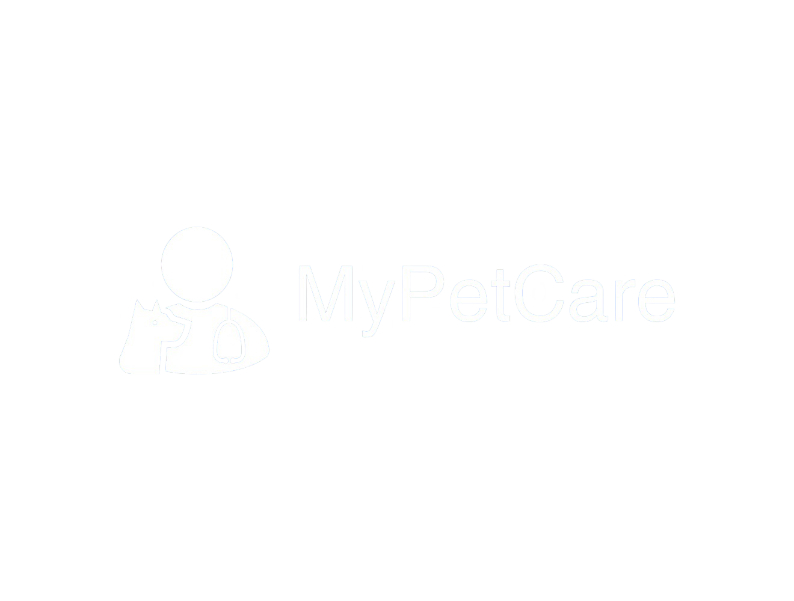

<p align="center">
  <a href="https://github.com/GabrielJuan349/MyPetCare">
    
  </a>

  <p align="center">
    Short description
    <br>
    <a href="https://github.com/GabrielJuan349/MyPetCare/issues/new?template=bug.md">Report bug</a>
    ·
    <a href="https://github.com/GabrielJuan349/MyPetCare/issues/new?template=feature.md&labels=feature">Request feature</a>
  </p>
</p>


## Table of contents

- [Quick start](#quick-start)
- [Status](#status)
- [What's included](#whats-included)
- [Bugs and feature requests](#bugs-and-feature-requests)
- [Contributing](#contributing)
- [Creators](#creators)
- [Thanks](#thanks)
- [Copyright and license](#copyright-and-license)


## Quick start

Some text

- Instruction 1
- Instruction 2
- Instruction 3

## Status

Here goes all the budgets

## What's included

Some text

```text
folder1/
└── folder2/
    ├── folder3/
    │   ├── file1
    │   └── file2
    └── folder4/
        ├── file3
        └── file4
```

## Bugs and feature requests

Have a bug or a feature request? Please first read the [issue guidelines](https://github.com/GabrielJuan349/MyPetCare/blob/master/CONTRIBUTING.md) and search for existing and closed issues. If your problem or idea is not addressed yet, [please open a new issue](https://github.com/GabrielJuan349/MyPetCare/issues/new).

## Contributing

Please read through our [contributing guidelines](https://github.com/GabrielJuan349/MyPetCare/blob/master/CONTRIBUTING.md). Included are directions for opening issues, coding standards, and notes on development.

Moreover, all HTML and CSS should conform to the [Code Guide](https://github.com/mdo/code-guide), maintained by [Main author](https://github.com/usernamemainauthor).

Editor preferences are available in the [editor config](https://github.com/GabrielJuan349/MyPetCare/blob/master/.editorconfig) for easy use in common text editors. Read more and download plugins at <https://editorconfig.org/>.

## Creators

**Yelennis Brissey Laura**

- Github: [yelennislaura](https://github.com/yelennislaura)
- [Linkedin](https://www.linkedin.com/in/yelennis-brissey-laura-rodriguez-548b94277/)

**Gabriel Juan**

- Github: [GabrielJuan349](https://github.com/GabrielJuan349)
- [Linkedin](https://www.linkedin.com/in/gabi-juan)


**Marc García**

- Github: [MarcGarciaUAB](https://github.com/MarcGarciaUAB)
<!-- - [Linkedin](https://www.linkedin.com/in/) -->

**Laia Ubeda**

- Github: [laiaubvi](https://github.com/laiaubvi)
- [Linkedin](https://www.linkedin.com/in/laia-úbeda-vivet-1445b6354)

**Eric Sánchez**

- Github: [ericsiz](https://github.com/ericsiz)
- [Linkedin](https://www.linkedin.com/in/eric-sánchez-ibañez-de-zuazo-70b747229)

**Xinyu Yu**

- Github: [itsYu04](https://github.com/itsYu04)
- [Linkedin](https://www.linkedin.com/in/x-yu)

**Daniel Bello**

- Github: [DaBM17](https://github.com/DaBM17)
<!-- - [Linkedin](https://www.linkedin.com/in/) -->

**Daniel Bermúdez**

- Github: [DanielBG26](https://github.com/DanielBG26)
- [Linkedin](https://www.linkedin.com/in/daniel-bermudez-galvan-135702244/)

## Thanks

Some Text

## Copyright and license

Code and documentation copyright 2023-2024 the authors. Code released under the [MIT License](https://github.com/GabrielJuan349/MyPetCare/blob/master/LICENSE).
